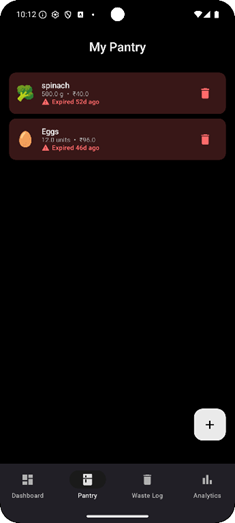

# 🌱 EcoBite — Smart Food Waste Tracker for Android

> **Eat smart. Waste less. Live lighter.**

EcoBite is an Android application that helps users track food inventory, reduce household food waste, and understand the financial and environmental impact of wasted food.

Built using **Kotlin**, **Jetpack Compose**, and **Gemini AI**, EcoBite combines smart pantry management with AI-powered recipe recommendations and sustainability analytics.

---

## 📌 Problem Statement

Every year, households waste large amounts of food without realizing the actual cost.

Food expires silently, gets discarded unnoticed, and the cycle continues.

EcoBite solves this problem by:

* Tracking pantry items and expiry dates
* Sending smart reminders before food expires
* Suggesting recipes using existing ingredients
* Showing the exact money, CO₂, and water wasted

The goal is to build awareness and help users make smarter consumption decisions.

---

# ✨ Features

## 📦 Smart Pantry

* Add food items manually
* Barcode scanning support
* Auto-fetch product details like:

  * Name
  * Category
  * Nutrition information



---

## ⚠️ Expiry Alerts

* Smart notifications before expiry
* Recipe suggestions attached with alerts
* Helps consume food before it goes bad

---

## 🗑️ Waste Logging

* One-tap waste tracking
* Add reasons for waste:

  * Forgot
  * Bought too much
  * Went bad
  * Didn’t like it

---

## 🌍 Environmental Impact Tracking

* Calculates:

  * CO₂ emissions
  * Water footprint
* Uses FAO emission factor datasets

---

## 💸 Cost Tracker

Track:

* Weekly food waste cost
* Monthly food waste cost
* Overall savings insights

---

## 📊 Analytics Dashboard

Visual insights including:

* Waste trends
* Category-wise breakdown
* Weekly & monthly charts
* Personal behavior patterns

---

## 🤖 AI Recipe Suggestions

Powered by **Gemini API**

* Suggests recipes using pantry contents
* Prioritizes items expiring soonest
* Reduces unnecessary waste

---

## 💡 Insight Engine

Behavior analysis such as:

* “You waste most food on weekends”
* “Vegetables expire most frequently”

---

# 🛠️ Tech Stack

| Layer                | Technology                   |
| -------------------- | ---------------------------- |
| Language             | Kotlin                       |
| UI                   | Jetpack Compose + Material 3 |
| Architecture         | MVVM + Repository Pattern    |
| Database             | Room (SQLite)                |
| Dependency Injection | Hilt                         |
| Async Programming    | Coroutines + StateFlow       |
| Networking           | Retrofit + OkHttp            |
| AI Integration       | Gemini API                   |
| Barcode & Camera     | CameraX + ML Kit             |
| Food Database        | Open Food Facts API          |
| Charts               | Vico                         |
| Background Tasks     | WorkManager                  |
| Preferences          | DataStore                    |

---

# 🏗️ Architecture

```text
UI (Jetpack Compose)
        ↓
ViewModel (StateFlow)
        ↓
Repository Layer
        ↓
Local DB (Room)  ←→  Remote APIs
                  (Gemini / Open Food Facts)
```

### Offline-First Design

* Room database acts as the single source of truth
* APIs only enrich local data
* Core functionality works without internet access

---

# 📈 Project Status

```text
Phase 1 — Core Tracker        ✅ Complete
Phase 2 — Barcode + Alerts    ✅ Complete
Phase 3 — Analytics           ✅ Complete
Phase 4 — Gemini AI Layer     🚧 In Progress
```

---

# 🚀 Getting Started

## Prerequisites

* Android Studio (Latest Stable Version)
* Android SDK API 26+
* Gemini API Key

---

## Installation

### 1️⃣ Clone the Repository

```bash
git clone https://github.com/your-username/ecobite.git
```

---

### 2️⃣ Open Project

Open the project in Android Studio.

---

### 3️⃣ Add Gemini API Key

Add the following inside `local.properties`

```properties
GEMINI_API_KEY=your_api_key_here
```

---

### 4️⃣ Run the App

Run on:

* Emulator
* Physical Android device

---

# 📚 Data Sources

Environmental impact calculations are based on:

* FAO datasets
* Our World in Data

All environmental figures are approximate estimates and clearly labeled within the app.

---

# 🎯 Future Improvements

* OCR-based receipt scanning
* Shared family pantry
* Smart grocery recommendations
* Voice assistant support
* Cloud sync & backup
* AI meal planning

---

# 👨‍💻 Developed As

Built as an Android internship side project focused on:

* Real-world sustainability problems
* AI integration
* Offline-first mobile architecture
* End-to-end Android development

---

# 📄 License

This project is intended for educational and internship demonstration purposes.
